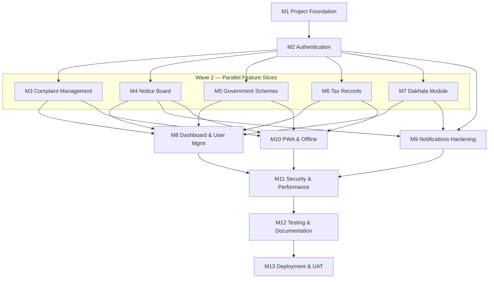

# Digital Gram Panchayat — Project Execution Plan

Vertical-slice roadmap. Backend + frontend built together every feature. Follows Blueprint + SRS + Synopsis. No separated backend-only phases. Every milestone = usable, demo-ready product.

Terse style. Technical substance whole. Names exact.

---

# Development Strategy — Which Approach

## Option A — Backend First
Build all APIs, then all UI.
- Pro: clean API contract, backend fully tested before UI.
- Con: **weeks with nothing demoable.** No usable product until frontend starts. Late integration bugs. Client + evaluator see zero for long. Frontend devs idle early.

## Option B — Frontend First
Build all UI on mock data, then wire backend.
- Pro: fast visual demo, UX feedback early.
- Con: mock-to-real rewrite pain. Hidden backend risk surfaces late (GPS, PDF, SMS). Fake demo != working product. Big integration cliff.

## Option C — Vertical Slice (RECOMMENDED)
Each milestone = one feature end-to-end: DB + API + logic + UI + validation + auth + test + docs. Ship working feature, then next.
- Pro: **every milestone demo-ready, real product grows.** Integration risk killed per-slice (small, continuous). Feature folders isolate = parallel work, few merge conflicts. Matches Blueprint feature-based architecture + SRS milestone "independently testable" rule. Client sees progress each milestone. Team maps 1 dev to 1 vertical.
- Con: needs shared contract discipline (solved: `packages/shared` zod+types defined first).

## Verdict: **Option C, Vertical Slice.**
**Why for this project.**
1. Capstone + real client = must demo working feature often, not backend code.
2. Blueprint already feature-based (`features/` folders both stacks) = vertical slice is native fit.
3. High-risk pieces (GPS, Cloudinary, PDF Marathi font, SMS) each validated inside their own slice early, not stacked at end.
4. 5 devs = 5 parallel verticals after auth done, isolated feature folders, minimal conflict.
5. SRS demands each milestone independently testable — vertical slice guarantees it.

Rule enforced: `packages/shared` schemas/types defined in M1, so both stacks code against one contract from day one. No mock-to-real rewrite.

---

# Milestone Roadmap (Vertical Slices)

Waves:
- Wave 0: M1 (all together).
- Wave 1: M2 auth (blocking, all).
- Wave 2: M3-M7 feature slices (**parallel**, independent folders).
- Wave 3: M8-M9 converge (need data + notifications hardened).
- Wave 4: M10-M13 cross-cut + ship.

Notification service: mock stub built M2 (OTP needs it), real provider wired M4 (first broadcast), hardened M9. Each slice wires own notification call — no shared-file contention.

---

## Milestone 1 — Project Foundation

**Goal.** Runnable monorepo, three apps, shared contract, CI, DB connect. Skeleton every later slice plugs into.

**Why this stage.** Nothing builds without folder structure, shared types, tooling. Removes all architecture decisions before feature work. Defines contract that makes parallel slices safe.

**Features Included.** No user feature. Infra: workspace, shared package, health check, auth-less shell both frontends, DB connection.

**Backend Tasks.**
- Database Collections: none yet (connection only).
- Models: none.
- Controllers: health.
- Services: config loader, db connect.
- Routes: GET /api/health.
- Middleware: error handler, helmet, cors, logger baseline.
- Validation: env schema (fail-fast boot).
- APIs: /api/health -> 200 {status,uptime}.
- Testing: health 200, boot with missing env fails.

**Frontend Tasks (Citizen PWA).**
- Pages: Splash, empty Home shell, 404.
- Components: AppShell, BottomNav, Header, LanguageToggle stub.
- Hooks: useOnline.
- API Integration: axios instance + queryClient.
- State Management: LanguageContext, ThemeContext.
- Forms: none.
- Validation: none.
- Testing: shell renders, nav routes.

**Frontend Tasks (Admin Portal).**
- Pages: empty Dashboard shell, 404.
- Components: DashboardShell, Sidebar, Header.
- Dashboard Changes: placeholder metric grid.
- API Integration: axios + queryClient.
- Forms: none.
- Validation: none.
- Testing: shell renders, sidebar routes.

**Shared Tasks.**
- Types: base response envelope, enums (roles, statuses, categories, cert types).
- Constants: category list, status colors, cert types.
- Utilities: response helpers, date format.
- Localization: i18next init, en.json + mr.json skeleton.
- Documentation: README setup, .env.example each app, folder map.

**UI/UX Deliverables.** App shells both apps, bottom nav (citizen), sidebar (admin), language toggle, theme, splash, 404.

**Database Deliverables.** Atlas cluster live, connection string, connect verified.

**API Deliverables.** /api/health.

**Acceptance Criteria.** All 3 apps run local. /api/health 200. CI green (lint+typecheck+test). Both frontends import `packages/shared`. Env validated boot.

**Demo Scenario.** Open citizen PWA (shell + nav + language toggle), admin portal (sidebar shell), hit health endpoint. Foundation proven.

**Git Branch Name.** `feature/project-foundation`

**Estimated Complexity.** Low.

**Dependencies.** None.

---

## Milestone 2 — Authentication

**Goal.** Citizen register + OTP login, officer password login, JWT, role gate. Every later slice reuses this auth.

**Why this stage.** All protected features need auth + role middleware + AuthContext. Blocking prerequisite. Build once, reuse everywhere.

**Features Included.** Citizen register (name, mobile, address) + OTP verify. Citizen login (mobile->OTP). Officer login (username+password). JWT session. Role-based access. Profile view/edit.

**Backend Tasks.**
- Database Collections: users, otps.
- Models: User (role discriminator, sparse unique mobile/username), Otp (TTL).
- Controllers: register, login, verifyOtp, officerLogin, me, updateProfile.
- Services: authService, otpService (generate+hash+verify+lock), jwtService, notificationService (SMS stub for OTP).
- Routes: /auth/register, /auth/login, /auth/verify-otp, /auth/officer/login, /auth/me, PATCH /auth/profile.
- Middleware: auth (verify JWT), role (citizen/officer gate), validate (zod), rateLimit (tight on auth/OTP).
- Validation: mobile 10-digit, otp 6-digit, username/password non-empty (shared zod).
- APIs: full auth set section 6.
- Testing: register->otp->verify->token; wrong otp; expired otp; attempt lockout; officer login; citizen token blocked on /admin; expired token 401; profile update.

**Frontend Tasks (Citizen PWA).**
- Pages: Register, Login, OTP entry, Profile.
- Components: MobileInput, OtpInput, ConfirmButton, ProfileForm.
- Hooks: useAuth, useOtpTimer.
- API Integration: auth mutations (TanStack Query).
- State Management: AuthContext (user, token, login, logout), 401 axios interceptor -> logout+redirect.
- Forms: register, login, profile (React Hook Form + Zod).
- Validation: inline field errors, resend cooldown.
- Testing: register flow, otp entry, expired session redirect, profile edit.

**Frontend Tasks (Admin Portal).**
- Pages: Officer Login, protected route guard.
- Components: PasswordInput, LoginForm.
- Dashboard Changes: gate dashboard behind auth.
- API Integration: officerLogin mutation.
- Forms: login (RHF+Zod).
- Validation: field errors, wrong-credential message.
- Testing: officer login, protected route blocks unauth, logout.

**Shared Tasks.**
- Types: User, AuthResponse, Role enum.
- Constants: token expiry, roles.
- Utilities: token storage guarded, auth header attach.
- Localization: auth strings en+mr.
- Documentation: auth flow doc, OTP behavior.

**UI/UX Deliverables.** Register+login+OTP+profile (citizen), officer login (admin), protected routing both.

**Database Deliverables.** users + otps collections, indexes (mobile/username unique sparse, otp TTL).

**API Deliverables.** All /auth/* endpoints.

**Acceptance Criteria.** Citizen register->OTP->token works. Officer login works. Citizen token rejected on /admin (403). Expired token 401 -> redirect login. OTP hashed, TTL expires, lockout after 5 attempts. Profile updates.

**Demo Scenario.** New citizen registers on phone, gets OTP, logs in, edits profile. Officer logs into portal, sees gated dashboard shell. Show citizen blocked from admin API.

**Git Branch Name.** `feature/authentication`

**Estimated Complexity.** Medium.

**Dependencies.** M1.

---

## Milestone 3 — Complaint Management

**Goal.** Citizen submit complaint (GPS + photos) + track. Officer list/detail/status/remark with map. SMS on status change.

**Why this stage.** Core citizen value, highest-priority SRS module. Validates hardest tech early (GPS, upload, map) inside one slice. First full user-to-officer loop.

**Features Included.** Submit complaint (category, description, <=3 photos, GPS confirm). Track own list + status. Officer table (search/filter/sort). Officer detail (photos, Leaflet map, status update, remark). SMS notify citizen on update. Audit.

**Backend Tasks.**
- Database Collections: complaints.
- Models: Complaint (GeoJSON Point, statusHistory, remarks).
- Controllers: create, listMine, getOne, adminList, updateStatus.
- Services: complaintService, uploadService (Cloudinary+multer), auditService, notificationService (SMS status).
- Routes: POST /complaints, GET /complaints/mine, GET /complaints/:id, GET /admin/complaints, PATCH /admin/complaints/:id/status.
- Middleware: auth, role, validate, upload, rateLimit.
- Validation: category enum, description required, photos<=3 image<=5MB, coords range, ownership.
- APIs: complaint set section 6.
- Testing: submit with/without GPS, >3 photo reject, oversize reject, status update triggers SMS+audit, citizen cannot read other's complaint.

**Frontend Tasks (Citizen PWA).**
- Pages: Complaint (submit), Complaint History, Complaint Detail.
- Components: CategorySelect, PhotoUploader (preview, max3), GpsConfirm (map thumbnail), StatusBadge, MapView.
- Hooks: useGeolocation, useComplaints, useComplaintMutation.
- API Integration: submit multipart, list, detail.
- State Management: React Query cache, invalidate on submit.
- Forms: complaint form (RHF+Zod).
- Validation: photo count/size, GPS optional path.
- Testing: submit happy, GPS denied path, list renders status colors.

**Frontend Tasks (Admin Portal).**
- Pages: Complaints list, Complaint detail.
- Components: DataTable (search/filter status,category,date,ward/sort), MapView (Leaflet interactive), StatusDropdown, RemarkBox, ConfirmDialog.
- Dashboard Changes: none yet (M8).
- API Integration: adminList, updateStatus mutation.
- Forms: status+remark update.
- Validation: status enum, remark on resolve.
- Testing: table filter, status update, map renders GPS.

**Shared Tasks.**
- Types: Complaint, ComplaintStatus, Category.
- Constants: categories, status color map.
- Utilities: buildComplaintId, coord validate.
- Localization: complaint strings en+mr.
- Documentation: complaint API + flow.

**UI/UX Deliverables.** Submit form + GPS map thumbnail + photo preview (citizen), status-colored history, officer table + interactive map + status flow.

**Database Deliverables.** complaints collection, indexes (citizenId, status, category, createdAt, ward, 2dsphere location, complaintId unique).

**API Deliverables.** All complaint endpoints.

**Acceptance Criteria.** Citizen submits with photos+GPS, gets complaintId+Pending. GPS-denied still submits. Officer filters, opens map, updates status. Citizen receives SMS + sees new status. Citizen cannot access another's complaint. Audit logged.

**Demo Scenario.** Citizen files pothole complaint with photo + auto GPS. Officer opens on map, marks In Progress, adds remark. Citizen phone shows updated status + SMS. Full civic loop live.

**Git Branch Name.** `feature/complaint-management`

**Estimated Complexity.** High.

**Dependencies.** M2. (Uses Cloudinary, Leaflet.)

---

## Milestone 4 — Notice Board & Communication

**Goal.** Officer CRUD notices + broadcast SMS/voice. Citizen public read. First real notification provider wiring.

**Why this stage.** Parallel to M3 (separate folder). Activates real SMS/voice provider (OTP was stub) so broadcast + later dakhala reuse it. Public read = no auth dependency risk.

**Features Included.** Officer create/edit/delete (soft) notice + attachment. Broadcast SMS/voice to all citizens (summary). Citizen public notice list + detail + attachment. Notification logging.

**Backend Tasks.**
- Database Collections: notices, notifications.
- Models: Notice (broadcast meta, soft isActive), Notification (log).
- Controllers: create, update, delete, broadcast, publicList, publicDetail.
- Services: noticeService, notificationService (real Twilio/MSG91, batch async), auditService.
- Routes: POST/PUT/DELETE /admin/notices, POST /admin/notices/:id/broadcast, GET /notices, GET /notices/:id.
- Middleware: auth+role (write), public (read), validate, upload, rateLimit.
- Validation: title+body required, attachment pdf/image<=5MB, summary<=160.
- APIs: notice set section 6.
- Testing: public read no token, officer CRUD gated, broadcast queues N notifications, soft delete, partial-fail logged.

**Frontend Tasks (Citizen PWA).**
- Pages: Notice list, Notice detail.
- Components: NoticeCard, AttachmentViewer.
- Hooks: useNotices.
- API Integration: public list+detail (no token).
- State Management: React Query cache (offline-cacheable later M10).
- Forms: none.
- Validation: none.
- Testing: list reverse-chrono, attachment opens, works logged-out.

**Frontend Tasks (Admin Portal).**
- Pages: Notices list, Notice form.
- Components: NoticeForm, BroadcastToggle (sms/voice+summary), NoticeTable, ConfirmDialog (delete + broadcast cost warn).
- Dashboard Changes: none yet.
- API Integration: CRUD + broadcast mutations.
- Forms: notice create/edit (RHF+Zod).
- Validation: summary length, attachment type/size.
- Testing: create, edit, soft delete confirm, broadcast confirm.

**Shared Tasks.**
- Types: Notice, Notification, Channel.
- Constants: broadcast channels, SMS length.
- Utilities: summary truncate.
- Localization: notice strings en+mr.
- Documentation: notice + broadcast API, provider config.

**UI/UX Deliverables.** Public notice feed (citizen, no login), officer notice CRUD + broadcast toggles + cost-warn confirm.

**Database Deliverables.** notices + notifications collections, indexes (createdAt desc, isActive; to, status, at).

**API Deliverables.** Notice + broadcast endpoints.

**Acceptance Criteria.** Officer publishes notice, optional broadcast. Citizen (even logged out) reads feed + attachment. Broadcast dispatches to all registered mobiles under 30s, logged, partial fail captured. Delete soft.

**Demo Scenario.** Officer posts water-shutdown notice, triggers SMS broadcast. Citizens' phones get SMS. Anyone opens PWA notice board, reads it. Communication loop live.

**Git Branch Name.** `feature/notice-board`

**Estimated Complexity.** Medium.

**Dependencies.** M2. (Real SMS/voice provider account.)

---

## Milestone 5 — Government Schemes

**Goal.** Officer CRUD schemes. Citizen browse + search + detail + external link.

**Why this stage.** Simplest independent slice, parallelizable, low risk. Good for single dev while others on complex slices. No external deps beyond DB.

**Features Included.** Officer add/edit/delete scheme. Citizen card grid, keyword search, detail (eligibility, benefits, procedure, official link).

**Backend Tasks.**
- Database Collections: schemes.
- Models: Scheme (text-indexed name+description, tags, isActive).
- Controllers: create, update, delete, list, search, getOne.
- Services: schemeService.
- Routes: GET /schemes, GET /schemes/:id, GET /schemes?q=, POST/PUT/DELETE /admin/schemes.
- Middleware: auth+role (write), public (read), validate.
- Validation: name required, officialLink valid url.
- APIs: scheme set section 6.
- Testing: keyword search hits text index, officer CRUD gated, public read.

**Frontend Tasks (Citizen PWA).**
- Pages: Scheme list, Scheme detail.
- Components: SchemeCard, SearchBar.
- Hooks: useSchemes, useSchemeSearch.
- API Integration: list, search, detail.
- State Management: React Query, debounced search.
- Forms: search only.
- Validation: none.
- Testing: search filters, external link rel=noopener, empty state.

**Frontend Tasks (Admin Portal).**
- Pages: Schemes list, Scheme form.
- Components: SchemeForm, SchemeTable, ConfirmDialog.
- Dashboard Changes: none.
- API Integration: CRUD mutations.
- Forms: scheme create/edit (RHF+Zod).
- Validation: url validity, required fields.
- Testing: create, edit, delete.

**Shared Tasks.**
- Types: Scheme.
- Constants: scheme tags.
- Utilities: url validate.
- Localization: scheme strings en+mr.
- Documentation: scheme API.

**UI/UX Deliverables.** Card grid + search + detail (citizen), officer scheme CRUD table+form.

**Database Deliverables.** schemes collection, text index name+description, isActive index.

**API Deliverables.** Scheme endpoints.

**Acceptance Criteria.** Officer adds scheme. Citizen browses, searches by keyword (text index), opens detail, follows external link new tab. Empty-search state shown.

**Demo Scenario.** Officer adds "PM Awas Yojana". Citizen searches "awas", opens card, reads eligibility, taps official portal link. Scheme directory live.

**Git Branch Name.** `feature/government-schemes`

**Estimated Complexity.** Low.

**Dependencies.** M2.

---

## Milestone 6 — Tax Records (Gharpatti & Pani Patti)

**Goal.** Officer add/update tax records with append-only audit history + payments. Citizen view own records + dues + history.

**Why this stage.** Independent slice, parallel. Introduces audit-history pattern (SRS transparency). View-only citizen = low frontend risk, medium backend (history integrity).

**Features Included.** Officer add property/water record, update amount, mark payment, view audit history. Citizen view own Gharpatti + Pani Patti, dues, payment history. View-only phase 1.

**Backend Tasks.**
- Database Collections: taxrecords.
- Models: TaxRecord (type enum, payments[], append-only history[]).
- Controllers: adminList, create, update, addPayment, getHistory, mine.
- Services: taxService (history append every mutation), auditService.
- Routes: GET /tax/mine, GET /admin/tax, POST /admin/tax, PATCH /admin/tax/:id, POST /admin/tax/:id/payment, GET /admin/tax/:id/history.
- Middleware: auth, role, validate.
- Validation: type enum, amounts>=0, ownership on /mine.
- APIs: tax set section 6.
- Testing: update appends history, previous preserved, citizen sees own only, negative amount reject.

**Frontend Tasks (Citizen PWA).**
- Pages: Tax summary.
- Components: TaxCard (Gharpatti, Pani Patti), PaymentHistoryTable.
- Hooks: useTaxRecords.
- API Integration: GET /tax/mine.
- State Management: React Query.
- Forms: none (view only).
- Validation: none.
- Testing: renders own records, dues, history, empty state.

**Frontend Tasks (Admin Portal).**
- Pages: Tax list, Tax form, Tax history view.
- Components: TaxForm, TaxTable, PaymentModal, AuditTimeline.
- Dashboard Changes: none.
- API Integration: CRUD + payment + history.
- Forms: add/update record, add payment (RHF+Zod).
- Validation: amounts>=0, type enum.
- Testing: update creates history entry, payment recorded, history view.

**Shared Tasks.**
- Types: TaxRecord, TaxType, Payment, HistoryEntry.
- Constants: tax types.
- Utilities: currency format.
- Localization: tax strings en+mr.
- Documentation: tax API + history model.

**UI/UX Deliverables.** Citizen tax cards + payment history, officer add/update + audit timeline.

**Database Deliverables.** taxrecords collection, indexes (citizenId, type, propertyRef).

**API Deliverables.** Tax endpoints.

**Acceptance Criteria.** Officer adds record, updates amount (history entry created, prior preserved), marks payment. Citizen views only own records + dues + history. Negative amount rejected.

**Demo Scenario.** Officer enters a household's Gharpatti, updates dues, records payment. Citizen logs in, sees property tax, water tax, payment history. Officer opens audit timeline showing every change. Transparency live.

**Git Branch Name.** `feature/tax-records`

**Estimated Complexity.** Medium.

**Dependencies.** M2.

---

## Milestone 7 — Dakhala (Certificate Application)

**Goal.** Citizen apply + track + download PDF. Officer review + approve (PDF gen) / reject (reason). SMS both ways.

**Why this stage.** Highest-risk slice (PDF Marathi font, access-controlled files, doc upload). Independent folder, parallel-capable but assign strong dev. Completes citizen service set.

**Features Included.** Apply (type, form, docs). Track status. Download approved PDF. Officer list/detail, approve (generate + store PDF + SMS), reject (mandatory reason + SMS).

**Backend Tasks.**
- Database Collections: dakhalaapplications.
- Models: DakhalaApplication (type enum, formData, documents[], certificateUrl, statusHistory).
- Controllers: apply, listMine, getOne, getCertificate, adminList, approve, reject.
- Services: dakhalaService, pdfService (PDFKit + Devanagari font), uploadService, notificationService, auditService.
- Routes: POST /dakhala, GET /dakhala/mine, GET /dakhala/:id, GET /dakhala/:id/certificate, GET /admin/dakhala, PATCH /admin/dakhala/:id/approve, PATCH /admin/dakhala/:id/reject.
- Middleware: auth, role, validate, upload.
- Validation: type enum, required fields per type, docs pdf/image<=5MB, rejectionReason required on reject, ownership on certificate.
- APIs: dakhala set section 6.
- Testing: apply happy, approve generates PDF+SMS, reject needs reason, citizen download own only, wrong-type field reject, PDF Marathi render.

**Frontend Tasks (Citizen PWA).**
- Pages: Certificate apply, Application list, Application detail + PDF download.
- Components: CertTypeSelect, DakhalaForm (dynamic per type), DocUploader, StatusBadge, PdfDownload.
- Hooks: useDakhala, useDakhalaMutation.
- API Integration: apply multipart, list, detail, certificate.
- State Management: React Query.
- Forms: dynamic cert form (RHF+Zod per type).
- Validation: required per type, doc size/type.
- Testing: apply flow, status track, download own approved.

**Frontend Tasks (Admin Portal).**
- Pages: Dakhala list, Application detail.
- Components: DakhalaTable, ApplicationDetail (form+docs viewer), ConfirmDialog (name+cert type), RejectReasonModal.
- Dashboard Changes: none yet.
- API Integration: adminList, approve, reject.
- Forms: reject reason (required).
- Validation: reason mandatory.
- Testing: approve triggers PDF, reject requires reason, confirm shows name+type.

**Shared Tasks.**
- Types: DakhalaApplication, CertType, DakhalaStatus.
- Constants: cert types, per-type field maps.
- Utilities: buildApplicationId.
- Localization: dakhala strings en+mr.
- Documentation: dakhala API, PDF template, font note.

**UI/UX Deliverables.** Citizen apply + track + PDF download, officer review + approve/reject confirm.

**Database Deliverables.** dakhalaapplications collection, indexes (citizenId, status, type, createdAt, applicationId unique).

**API Deliverables.** Dakhala endpoints.

**Acceptance Criteria.** Citizen applies, gets applicationId. Officer approves -> PDF generated (Marathi renders) + stored + citizen SMS + download available. Reject requires reason -> citizen SMS. Citizen downloads own cert only.

**Demo Scenario.** Citizen applies for Residence Certificate, uploads doc. Officer reviews, approves. Citizen gets SMS, downloads PDF certificate (bilingual). Show reject-with-reason path too. Certificate service live.

**Git Branch Name.** `feature/dakhala-module`

**Estimated Complexity.** High.

**Dependencies.** M2. (Cloudinary, PDFKit, Devanagari font.)

---

## Milestone 8 — Dashboard & User Management

**Goal.** Officer real-time metrics + charts + activity feed. Manage citizen accounts (view/activate/deactivate).

**Why this stage.** Needs data from M3-M7 to be meaningful. Converge point. Aggregates existing collections, adds user admin.

**Features Included.** Metric cards (citizens, pending complaints, pending dakhala, active notices). Charts (complaints by category/status). Activity feed. User table search/filter, detail, activate/deactivate.

**Backend Tasks.**
- Database Collections: reuse users, complaints, dakhala, notices, auditlogs (aggregate).
- Models: none new.
- Controllers: metrics, charts, activity, userList, userDetail, userStatus.
- Services: dashboardService (aggregate + 60s cache), userService, auditService.
- Routes: GET /admin/dashboard/metrics, /charts, /activity; GET /admin/users, /admin/users/:id, PATCH /admin/users/:id/status.
- Middleware: auth, role, validate.
- Validation: status enum, no self-deactivate.
- APIs: dashboard + user set section 6.
- Testing: counts correct, charts shape, deactivate blocks login next request, self-deactivate blocked.

**Frontend Tasks (Citizen PWA).**
- Pages: none (admin feature). Optional: deactivated-account message on login.
- Testing: deactivated citizen sees blocked message.

**Frontend Tasks (Admin Portal).**
- Pages: Dashboard (real), Users list, User detail.
- Components: MetricCard, BarChart, PieChart (recharts), ActivityList, UserTable, StatusToggle, ConfirmDialog.
- Dashboard Changes: replace placeholder with live metrics + charts + feed.
- API Integration: dashboard queries, user mutations.
- Forms: status toggle.
- Validation: confirm before deactivate.
- Testing: metrics render, charts data, deactivate confirm.

**Shared Tasks.**
- Types: DashboardMetrics, ChartData, ActivityItem.
- Constants: chart colors.
- Utilities: aggregate format.
- Localization: dashboard strings.
- Documentation: dashboard + user API.

**UI/UX Deliverables.** Live admin dashboard (cards+charts+feed), user management table.

**Database Deliverables.** No new collections; aggregate queries + supporting indexes verified.

**API Deliverables.** Dashboard + user endpoints.

**Acceptance Criteria.** Dashboard shows accurate live counts + charts + recent activity. Officer deactivates citizen -> that citizen's next request/login blocked. Self-deactivate blocked. Empty-system shows zeros.

**Demo Scenario.** Officer opens dashboard: sees total citizens, pending complaints chart, recent activity. Deactivates a test account; that user can't log in. Command center live.

**Git Branch Name.** `feature/dashboard-user-management`

**Estimated Complexity.** Medium.

**Dependencies.** M3, M4, M5, M6, M7 (data), M2.

---

## Milestone 9 — Notifications Hardening

**Goal.** Robust SMS/voice: batch broadcast scale, retry, failure log, cost guard, voice-call flow. Consolidate all notification paths.

**Why this stage.** Notification stub/basic wired across M2/M3/M4/M7. Now harden centrally: scale (5000 under 30s), retry, voice, logging, before production. Cross-cut, done post-features.

**Features Included.** Async batch broadcast (5000 recipients). Retry failed. Voice-call pre-recorded flow. Full notification log + status. Cost-confirm guard. Provider abstraction (Twilio<->MSG91 swap).

**Backend Tasks.**
- Database Collections: notifications (extend status/retry).
- Models: Notification (retry count, providerMessageId).
- Controllers: retry, notificationLog view.
- Services: notificationService (queue, batch, retry, voice), providerAdapter.
- Routes: GET /admin/notifications, POST /admin/notifications/:id/retry.
- Middleware: auth, role.
- Validation: channel enum.
- APIs: notification log + retry.
- Testing: 5000 batch under 30s (mock), partial-fail retry, voice dispatch, provider swap via env.

**Frontend Tasks (Citizen PWA).**
- Pages: none.
- Testing: n/a.

**Frontend Tasks (Admin Portal).**
- Pages: Notification log (optional under Reports).
- Components: NotificationTable, RetryButton, StatusBadge.
- Dashboard Changes: add SMS/voice delivery stat card (optional).
- API Integration: log query, retry.
- Forms: none.
- Validation: none.
- Testing: log renders, retry works.

**Shared Tasks.**
- Types: NotificationStatus, RetryResult.
- Constants: retry policy, batch size.
- Utilities: batch chunk.
- Localization: notification admin strings.
- Documentation: notification architecture, provider swap guide.

**UI/UX Deliverables.** Admin notification log + retry, delivery stats.

**Database Deliverables.** notifications extended fields + indexes.

**API Deliverables.** Notification log + retry endpoints.

**Acceptance Criteria.** Broadcast 5000 dispatched under 30s. Failed retried. Voice call works. All channels logged with status. Provider swappable via env. Cost-confirm before mass send.

**Demo Scenario.** Officer broadcasts to full citizen list; delivery log shows sent/failed; retry a failed one; trigger a voice-call alert. Notification backbone hardened.

**Git Branch Name.** `feature/notifications-hardening`

**Estimated Complexity.** Medium.

**Dependencies.** M2, M4, M7 (notification consumers exist).

---

## Milestone 10 — PWA Features (Offline + Install + i18n)

**Goal.** Installable PWA, offline read, background sync for offline complaint, install prompt, complete Marathi.

**Why this stage.** Needs features present to cache. Cross-cut over finished slices. SRS C-2/C-3 compliance before ship.

**Features Included.** Manifest + icons. Service worker precache + runtime cache. Offline read (notices, schemes, tax). Background sync offline complaint queue. Install prompt. Full en/mr coverage all screens.

**Backend Tasks.**
- Database Collections: none.
- Models: none.
- Controllers: none (idempotency for queued complaint dedupe).
- Services: complaintService idempotency key handling.
- Routes: existing (accept idempotency header).
- Middleware: idempotency check.
- Validation: idempotency key.
- APIs: no new (extend complaint create).
- Testing: duplicate queued complaint deduped server-side.

**Frontend Tasks (Citizen PWA).**
- Pages: Offline fallback, Settings (language/theme/help), onboarding replay.
- Components: OfflineBanner, InstallPrompt, OnboardingFlow.
- Hooks: useOnline, useInstallPrompt, useBackgroundSync.
- API Integration: queue mutations offline (IndexedDB).
- State Management: SW cache + IndexedDB queue + React Query.
- Forms: settings.
- Validation: n/a.
- Testing: offline notices/schemes read, offline complaint syncs on reconnect, install prompt, both languages render.

**Frontend Tasks (Admin Portal).**
- Pages: none (desktop online-assumed).
- Testing: n/a (portal not PWA).

**Shared Tasks.**
- Types: SyncQueueItem.
- Constants: cache names, sync tags.
- Utilities: IndexedDB helpers, idempotency key gen.
- Localization: **complete** en.json + mr.json every screen, verify no missing keys.
- Documentation: PWA/offline behavior, caching strategy.

**UI/UX Deliverables.** Install prompt, offline banner, onboarding, settings, full bilingual UI.

**Database Deliverables.** None.

**API Deliverables.** Idempotent complaint create.

**Acceptance Criteria.** PWA installable (Add to Home Screen). Offline: notices/schemes/tax readable. Offline complaint queued, syncs on reconnect, no duplicate. Language toggle works every screen no reload. Loads <5s on 3G.

**Demo Scenario.** Install DGP to home screen. Turn off network: read cached notices, file a complaint (queued). Reconnect: complaint uploads automatically. Toggle Marathi across whole app. True PWA live.

**Git Branch Name.** `feature/pwa-offline`

**Estimated Complexity.** Medium.

**Dependencies.** M3 (offline complaint), M4, M5, M6 (offline read), M2.

---

## Milestone 11 — Security & Performance Hardening

**Goal.** OWASP hardening + performance targets met. Production-safe.

**Why this stage.** All features + integrations exist; harden holistically before deploy. Central, cross-cut.

**Features Included.** helmet, cors allowlist, rate limits all routes, input sanitize, file scan, complete audit coverage, indexes verified, lazy load, code split, bundle trim, image optimize, aggregate cache, gzip/brotli.

**Backend Tasks.**
- Database Collections: verify all indexes present.
- Models: schema-level constraints tightened.
- Controllers: consistent error envelope.
- Services: sanitize layer, audit on all mutations.
- Routes: rate limits tuned per route.
- Middleware: helmet, cors allowlist, rateLimit, sanitize, mime scan upload.
- Validation: full zod coverage audit.
- APIs: response gzip/brotli, projection/lean, pagination all lists.
- Testing: OWASP checks (injection, XSS, auth bypass, rate limit), load test 500 concurrent, list <1s @10k.

**Frontend Tasks (Citizen PWA).**
- Pages: ErrorBoundary wraps app.
- Components: RetryPrompt, ErrorBanner, Skeleton loaders.
- Hooks: n/a.
- API Integration: retry/backoff.
- State Management: cache tuning.
- Forms: n/a.
- Validation: n/a.
- Testing: lazy-load chunks, bundle size budget, 3G throttle load.

**Frontend Tasks (Admin Portal).**
- Pages: ErrorBoundary.
- Components: Skeleton, ErrorBanner.
- Dashboard Changes: chart lazy load.
- API Integration: retry.
- Forms: n/a.
- Validation: n/a.
- Testing: bundle budget, table pagination perf.

**Shared Tasks.**
- Types: error codes.
- Constants: rate limits, cache TTLs.
- Utilities: sanitize helper.
- Localization: error messages en+mr plain language.
- Documentation: security checklist, OWASP mapping, perf report.

**UI/UX Deliverables.** Error boundaries, skeletons, retry prompts, plain-language errors both languages.

**Database Deliverables.** All indexes verified, query plans checked.

**API Deliverables.** Hardened, compressed, paginated, rate-limited endpoints.

**Acceptance Criteria.** OWASP checks pass. 500 concurrent no degradation. List <1s @10k. PWA <5s 3G. Rate limits active. All mutations audited. Uploads mime-validated.

**Demo Scenario.** Show rate-limit blocking brute OTP. Show injection/XSS attempt rejected. Load-test dashboard. Show 3G-throttled fast load. Production-grade proven.

**Git Branch Name.** `feature/security-performance`

**Estimated Complexity.** Medium.

**Dependencies.** M1-M10.

---

## Milestone 12 — Testing & Documentation

**Goal.** Full automated test suite + Postman + e2e + manuals + API docs. Coverage targets met.

**Why this stage.** Codebase feature-complete + hardened; comprehensive verification + deliverable docs before deploy.

**Features Included.** Unit (services, utils, hooks, components). Integration (route+DB). API (Postman/newman CI). e2e (Playwright critical flows). Manual test checklist. Manuals EN+MR. API docs. ADRs.

**Backend Tasks.**
- Testing: jest+supertest all features, mongodb-memory-server, coverage >=80% services+auth.
- Documentation: JSDoc all endpoints, OpenAPI spec, Postman collection.

**Frontend Tasks (Citizen PWA).**
- Testing: RTL components, forms both languages, hooks, e2e register->complaint->track.
- Documentation: citizen user manual EN+MR (illustrated PDF), in-app help.

**Frontend Tasks (Admin Portal).**
- Testing: RTL tables/forms/dashboard, e2e officer login->approve dakhala->broadcast.
- Documentation: officer admin manual (PDF + tooltips).

**Shared Tasks.**
- Types: test fixtures.
- Constants: test data seeds.
- Utilities: test helpers, seed script.
- Localization: verify all keys covered by tests.
- Documentation: ADRs, architecture diagrams (system, deployment, data flow, auth, ERD), FAQ.

**UI/UX Deliverables.** In-app help, FAQ, onboarding verified. Manuals.

**Database Deliverables.** Seed script, test data.

**API Deliverables.** OpenAPI + Postman collection, newman in CI.

**Acceptance Criteria.** Coverage target met. CI runs unit+integration+api. e2e critical flows pass. Manuals delivered EN+MR. API docs complete. Manual checklist executed (device, 2G, offline, Marathi).

**Demo Scenario.** Run full test suite green in CI. Show Postman collection. Open citizen manual (Marathi) + officer manual. Walk e2e recording. Quality proven.

**Git Branch Name.** `feature/testing-documentation`

**Estimated Complexity.** Medium.

**Dependencies.** M1-M11.

---

## Milestone 13 — Deployment & UAT

**Goal.** Production deploy all three apps, monitoring, backups, client UAT sign-off.

**Why this stage.** Final. Everything tested + documented; ship + validate with client.

**Features Included.** Vercel deploy citizen + admin. Render deploy backend. Atlas prod + backups. Cloudinary prod. Env config. Health monitor. Uptime monitor. Client UAT.

**Backend Tasks.**
- Deployment: Render web service, prod env, PM2/Render auto-restart, /api/health monitor.
- Services: prod config, structured logging (no PII).
- Testing: smoke test prod endpoints, CORS prod origins.
- Documentation: deployment runbook, env matrix.

**Frontend Tasks (Citizen PWA).**
- Deployment: Vercel static + SW, prod API URL, install verify prod.
- Testing: prod smoke, install on real device, offline prod.

**Frontend Tasks (Admin Portal).**
- Deployment: Vercel, prod API URL, CORS.
- Testing: prod smoke, officer login prod.

**Shared Tasks.**
- Constants: prod URLs.
- Utilities: env matrix.
- Documentation: deployment runbook, backup/restore doc, monitoring guide, UAT checklist.

**UI/UX Deliverables.** Live citizen + admin URLs, installable prod PWA.

**Database Deliverables.** Prod Atlas, daily geo-separate backup, 30-day restore verified.

**API Deliverables.** Live prod API + health + monitoring.

**Acceptance Criteria.** All three live. Health monitor 99% target. Backup restore tested. Prod CORS/env correct. Real device install works. Client UAT sign-off obtained.

**Demo Scenario.** Full end-to-end on production: citizen installs PWA, registers, files complaint; officer resolves, broadcasts notice, approves certificate. Client signs off. Project shipped.

**Git Branch Name.** `release/production-deployment`

**Estimated Complexity.** Medium.

**Dependencies.** M1-M12.

---

# Team Development Plan — 5 Developers

Team (SRS Group 13). Full-stack per vertical, feature-folder isolation = minimal merge conflict.

| Dev | Name | Primary strength | Owns |
|---|---|---|---|
| Dev1 | Sarang | Backend/API/DB lead | Data models, core APIs, complaint slice |
| Dev2 | Aditya | Integrations | Cloudinary, SMS/voice, PDF, notice + notification slices |
| Dev3 | Prasad | Citizen PWA lead | Citizen frontend, PWA/offline, dakhala citizen |
| Dev4 | Shrivardhan | Admin portal lead | Admin frontend, dashboard, tax slice |
| Dev5 | Tushar | Shared/QA/DevOps | shared package, i18n, testing, CI/CD, deploy, schemes slice |

Note: "owns" = accountable; each vertical still full-stack, pairs cross layers.

## Per-milestone assignment + parallelism

### M1 Foundation (all together, sequential-ish)
- Dev5: workspace, CI, `packages/shared` (types/enums/zod scaffold), i18next init. **(everyone blocks on shared)**
- Dev1: backend boot, config, db connect, health, error/logger middleware.
- Dev3: citizen shell, AppShell, BottomNav, axios+queryClient.
- Dev4: admin shell, Sidebar, axios+queryClient.
- Dev2: Cloudinary/SMS/PDF account setup, env.example, provider stubs.
- Parallel: shells parallel after shared skeleton (Dev5 first day). Depends: all on shared contract.
- Merge: shared merged first, then each shell branch.

### M2 Authentication (all, blocking gate)
- Dev1: users+otps models, auth service, jwt, controllers, routes, role+auth middleware.
- Dev2: notificationService OTP stub (real provider hook).
- Dev3: citizen register/login/otp/profile pages + AuthContext + 401 interceptor.
- Dev4: officer login + protected route guard.
- Dev5: shared auth types/zod, auth tests, auth flow docs.
- Parallel: backend (Dev1) + citizen UI (Dev3) + admin UI (Dev4) parallel against shared auth contract. Depends: all frontend on Dev1 endpoints (mock via shared schema until ready).
- Merge: contract (Dev5) first, backend, then frontends.

### Wave 2 — M3-M7 PARALLEL (independent feature folders)
Assign one owner-pair per slice; run simultaneously.
- **M3 Complaint** — Dev1 (backend: complaint API, upload, geo, audit) + Dev3 (citizen submit/GPS/photo/track).  Dev4 adds admin complaint table+map when free.
- **M4 Notice** — Dev2 (backend: notice API, real SMS/voice, broadcast) + Dev4 (admin CRUD+broadcast) + Dev3 citizen public notice list (light).
- **M5 Schemes** — Dev5 (full slice, low complexity: backend + admin CRUD + citizen browse/search).
- **M6 Tax** — Dev1 (backend: tax API, audit history) + Dev4 (admin add/update/history, citizen view). Dev1 shares complaint+tax backend.
- **M7 Dakhala** — Dev2 (backend: dakhala API, PDF Marathi, upload) + Dev3 (citizen apply/track/download). Dev4 admin review when free.

Parallelism rules:
- Each slice own `features/<name>` folder both stacks = **no shared-file merge conflict**.
- `packages/shared` edits serialized: any dev adding shared type opens tiny PR, Dev5 reviews+merges fast, others rebase.
- Dev1 heavy (M3+M6 backend) — stagger: M3 first, M6 second. Dev2 heavy (M4+M7) — M4 first, M7 second.
- Recommended run order within wave: pair A (Dev1+Dev3) M3; pair B (Dev2+Dev4) M4; Dev5 M5 solo. Then rotate: Dev1+Dev4 M6; Dev2+Dev3 M7; Dev5 supports tests + shared.
- Depends: all on M2. None on each other (that's the point).

### M8 Dashboard & Users (converge)
- Dev1: aggregate services, user management API.
- Dev4: dashboard UI (cards, charts, feed), user table. **(admin lead natural owner)**
- Dev5: dashboard/user tests, shared types.
- Dev2/Dev3: finish any admin detail views from wave 2 (dakhala/complaint admin).
- Parallel: aggregation (Dev1) + UI (Dev4) parallel on shared metrics contract.
- Depends: M3-M7 data.

### M9 Notifications Hardening
- Dev2: batch/retry/voice/provider-adapter (owns notifications). 
- Dev4: admin notification log UI.
- Dev5: batch/retry tests, provider-swap doc.
- Parallel: Dev2 backend + Dev4 UI. Others continue M8 tail / start M10 prep.
- Depends: M2, M4, M7.

### M10 PWA & Offline
- Dev3: SW, manifest, offline read, background sync, install prompt, onboarding (owns PWA).
- Dev1: idempotency for queued complaint.
- Dev5: complete i18n en/mr all screens + missing-key check.
- Parallel: Dev3 PWA + Dev5 i18n + Dev1 idempotency parallel.
- Depends: M3-M6.

### M11 Security & Performance
- Dev1: helmet, cors, rate limit, sanitize, indexes, audit coverage (backend hardening).
- Dev2: upload mime scan, file security.
- Dev3+Dev4: frontend perf (lazy load, code split, bundle trim, error boundaries, skeletons).
- Dev5: load test, OWASP checks, security checklist doc.
- Parallel: backend (Dev1/2) + frontend perf (Dev3/4) + testing (Dev5).
- Depends: M1-M10.

### M12 Testing & Docs
- Dev5: CI test orchestration, coverage, Postman/newman, ADRs, diagrams (owns QA).
- Dev1: backend unit+integration.
- Dev2: integration for uploads/PDF/SMS.
- Dev3: citizen RTL + e2e + citizen manual EN/MR.
- Dev4: admin RTL + e2e + officer manual.
- Parallel: everyone writes own-area tests + docs simultaneously.
- Depends: M1-M11.

### M13 Deployment & UAT
- Dev5: CI/CD, Vercel+Render config, monitoring, backup verify (owns DevOps).
- Dev1: backend prod env, health, logging.
- Dev3: citizen PWA deploy + prod install test.
- Dev4: admin deploy + prod smoke.
- Dev2: prod integration keys (Cloudinary/SMS) + prod smoke.
- All: client UAT session.
- Parallel: three deploys parallel after backend live.
- Depends: M1-M12.

## Merge strategy
- Trunk: `develop` integration branch. `main` = production only.
- Each milestone/slice = own `feature/<name>` branch off `develop`.
- Small frequent PRs into `develop`. Never long-lived divergent branches.
- `packages/shared` changes: micro-PR, merged first, all rebase — prevents contract drift + conflict.
- Rebase feature branch on `develop` before PR (linear history, fewer conflicts).
- Feature-folder isolation = two slices rarely touch same file.
- Release: `develop` -> `main` tagged at M13.

## Git branch strategy
```
main            (production, tagged releases)
 └─ develop     (integration, always green)
     ├─ feature/project-foundation
     ├─ feature/authentication
     ├─ feature/complaint-management
     ├─ feature/notice-board
     ├─ feature/government-schemes
     ├─ feature/tax-records
     ├─ feature/dakhala-module
     ├─ feature/dashboard-user-management
     ├─ feature/notifications-hardening
     ├─ feature/pwa-offline
     ├─ feature/security-performance
     ├─ feature/testing-documentation
     └─ release/production-deployment
```
Conventional commits: feat/fix/chore/test/docs. Commit per logical unit; milestone = squash-merge or tagged merge.

## Code review strategy
- Every PR: min 1 reviewer, not author. Cross-layer: backend PR reviewed by a frontend dev consuming it (catches contract mismatch), and vice versa.
- `packages/shared` PR: Dev5 (contract owner) mandatory review.
- CI must be green (lint+typecheck+test) before review approval.
- Checklist: matches Blueprint layers, uses shared schema (no redefine), validation present, auth/role correct, tests included, i18n keys added, no secrets.
- Slice owner + Dev5 (QA) co-approve milestone-closing PR against Acceptance Criteria.
- High-risk slices (M3 complaint, M7 dakhala): 2 reviewers.

---

# Milestone Dependency Diagram



Text form (dependency list):
- M1 -> M2 (foundation before auth).
- M2 -> M3, M4, M5, M6, M7 (auth before every feature; these five run **parallel**).
- M3+M4+M5+M6+M7 -> M8 (dashboard needs feature data).
- M2+M4+M7 -> M9 (notification consumers exist).
- M3+M4+M5+M6 -> M10 (features to cache offline).
- M8+M9+M10 -> M11 (harden complete system).
- M11 -> M12 (test hardened build).
- M12 -> M13 (ship tested build).

Critical path: M1 -> M2 -> {M3/M7 longest slices} -> M8 -> M11 -> M12 -> M13.
Parallel win: M3-M7 five slices concurrent = biggest schedule compression, five devs fully utilized, isolated folders keep conflicts near zero.

---

End execution plan. Backend + frontend ship together every milestone. Start M1.
