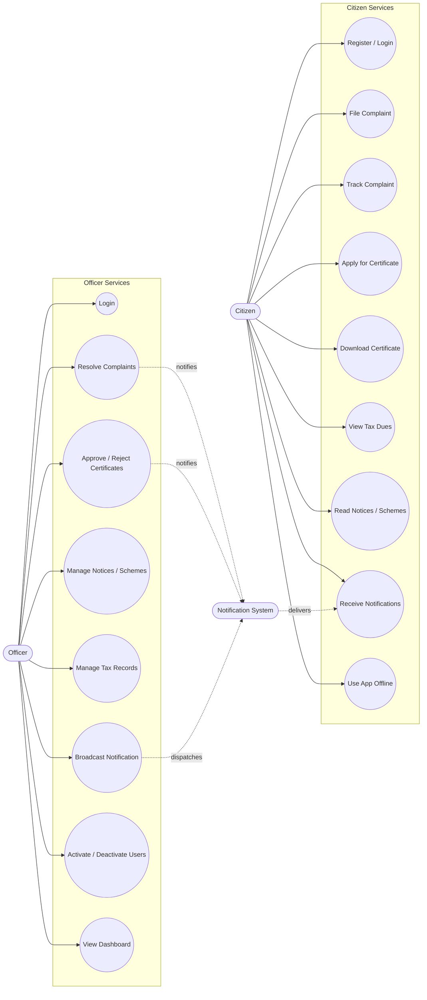
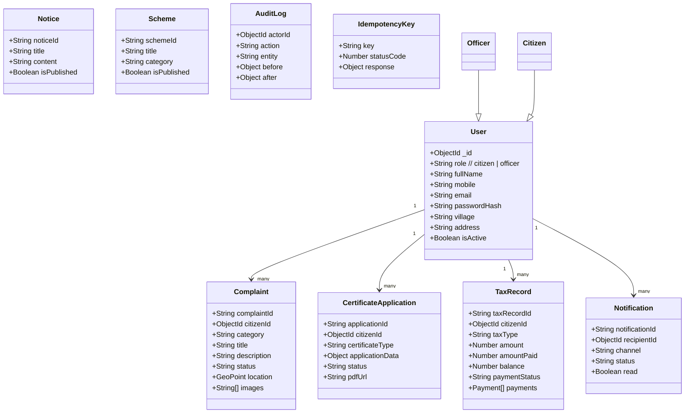
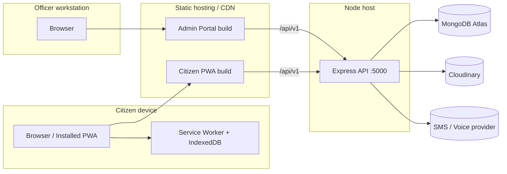
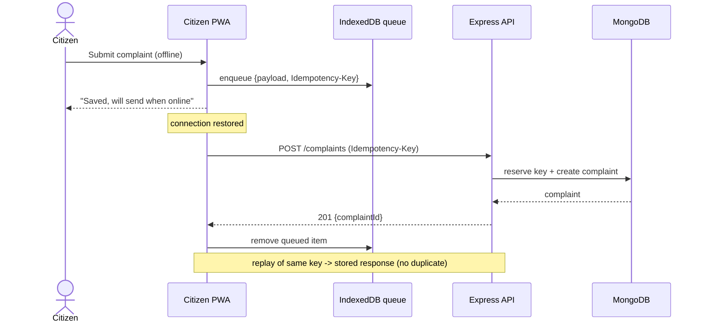
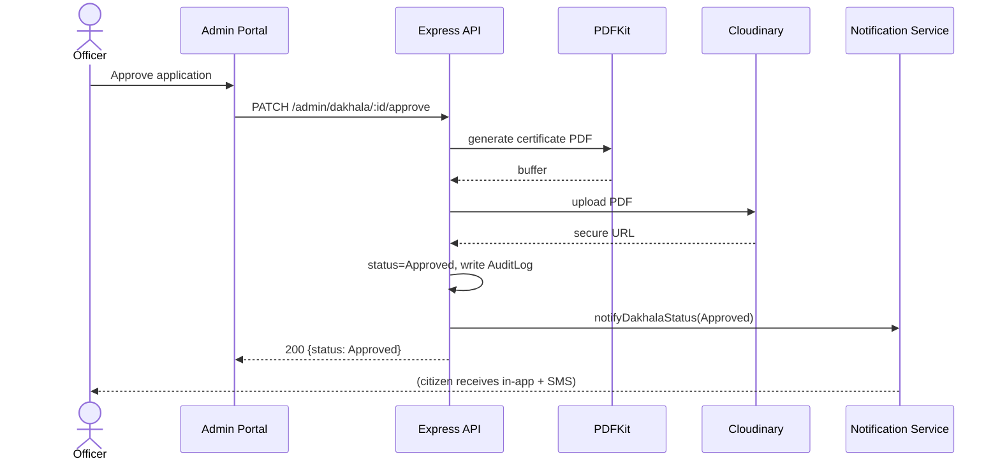
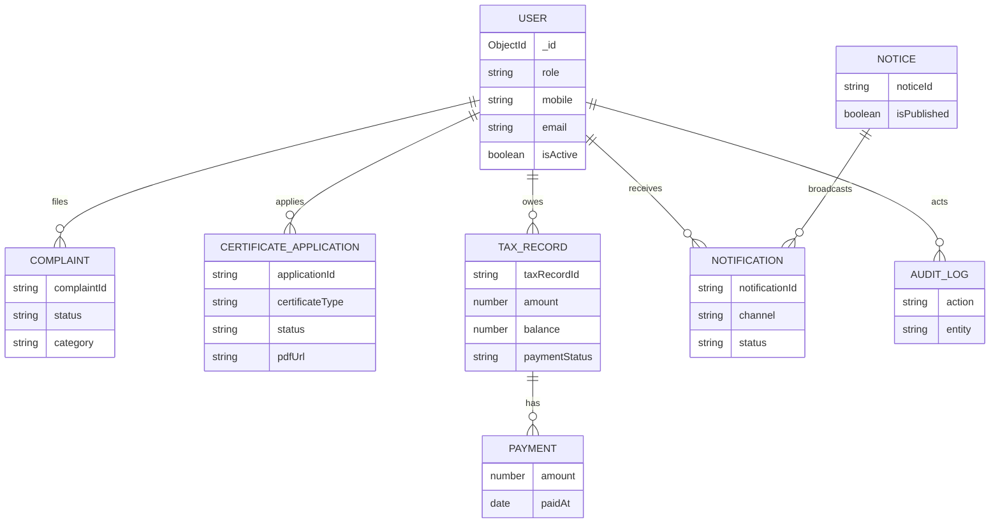
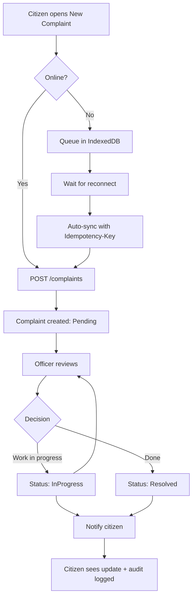
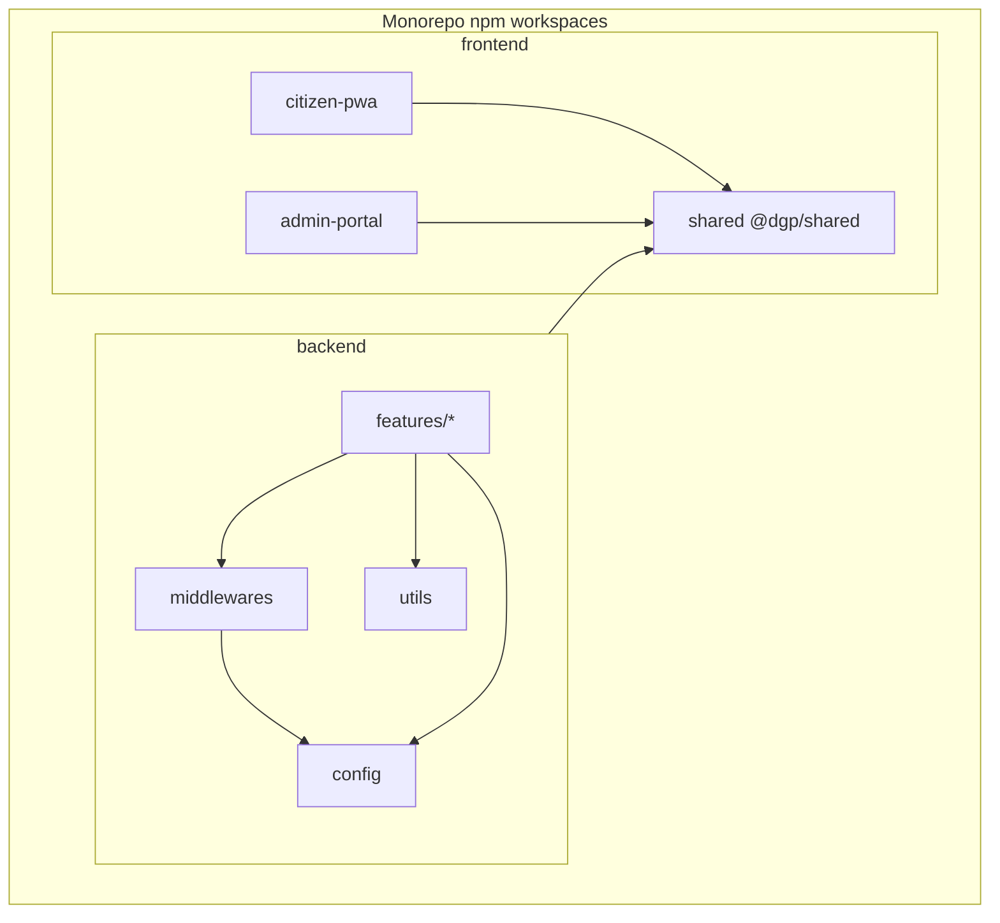

# UML Diagrams — Digital Gram Panchayat

All diagrams are Mermaid (render on GitHub / any Mermaid viewer).

## 1. Use Case Diagram



## 2. Class Diagram (domain models)



## 3. Component Diagram

```mermaid
flowchart TB
  subgraph Clients
    CP[Citizen PWA<br/>React + Vite + Workbox]
    AP[Admin Portal<br/>React + Vite]
  end
  SH[[@dgp/shared<br/>schemas · enums · utils]]
  subgraph Backend[Express API]
    MW[Middleware<br/>helmet · cors · rate-limit · auth · upload · idempotency]
    RT[Feature Routers]
    CT[Controllers]
    SV[Services]
    MD[Mongoose Models]
    NP[Notification Providers<br/>sms · voice · email]
  end
  DB[(MongoDB)]
  CDN[(Cloudinary)]

  CP & AP --> SH
  CP & AP -->|HTTPS JSON| MW --> RT --> CT --> SV --> MD --> DB
  SV --> NP
  SV --> CDN
  CP -. Service Worker cache .- CP
```

## 4. Deployment Diagram



## 5. Sequence Diagram — Offline complaint + idempotent sync



## 6. Sequence Diagram — Certificate approval



## 7. Entity-Relationship Diagram



## 8. Activity Diagram — Complaint lifecycle



## 9. Package Diagram


